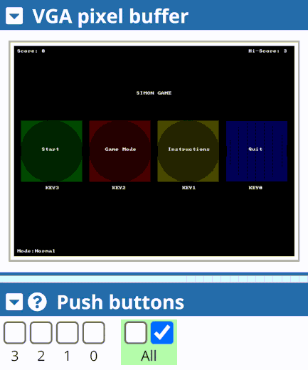

# Simon-Game

**General Information:**
The game is completely controlled by the KEY[3-0] inputs. As soon as the program is compiled,
a start menu with 4 drawn buttons to choose from are drawn. Each button is labelled with its
corresponding KEY button and can be accessed by their corresponding button releases. KEY
button presses are detected using edge capture and text is drawn using the character buffer.

Game in action, curtesy of https://cpulator.01xz.net/

**Main Menu Options (Inside the game):**
**Start:** Start the game
**Game mode:** Change the game mode
**Instructions:** To understand how to play
**Quit:** Clears the pixel and character buffers and displays a black screen on an infinite while loop

**Game Instructions:**
Once the game starts, a randomly coloured button will be lit up. To pass the first level, press the
KEY that corresponds to the colour. Once a KEY button press is detected, its corresponding
button on the VGA screen will light up. The user input will be compared to the sequence
memory and the game will either move on to the next level or display a game over screen. The
score and level are updated in real time. With each increasing level, another light will be added
in the sequence, and you will have to repeat the whole sequence for as long as you can.

**Game Modes:**
**Normal:** Sequence will be shown and randomly generated as normal
**Hard:** Sequence display speed is 3 times faster
**Random:** Entire sequence is randomized to be different at every level
**Moving Boxes:** In this game mode, whenever the program is waiting for the user’s input, the
buttons will move around in a random direction and bounce around the screen. The player will
have to keep track of which KEY corresponds to which button as the game progresses.
The game mode will always be displayed on the main screen at all times in the bottom left
corner. Normal mode is the default mode. The current level, your current score, and the current
high score will be displayed on the screen.

**After a Game is Finished:**
After completing a game, your score will be saved and compared with the highest score (which,
by default will be 0 when the game is loaded for the first time). If the highest score was
surpassed, then a special text will be displayed and the new high score will be updated.

**Credits:** Danny Zhang, Saskia George
